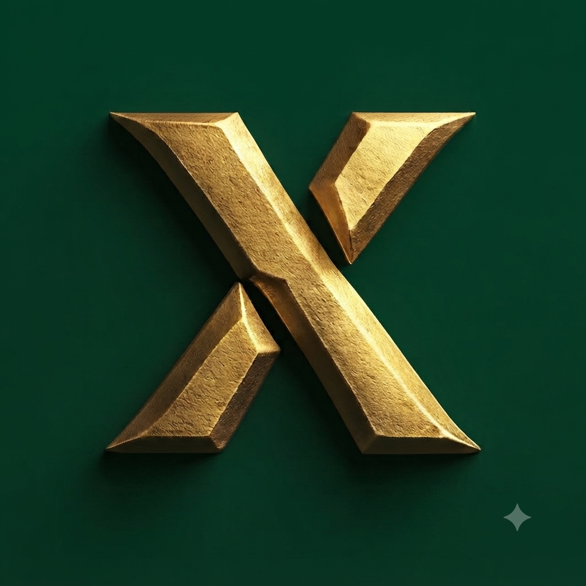
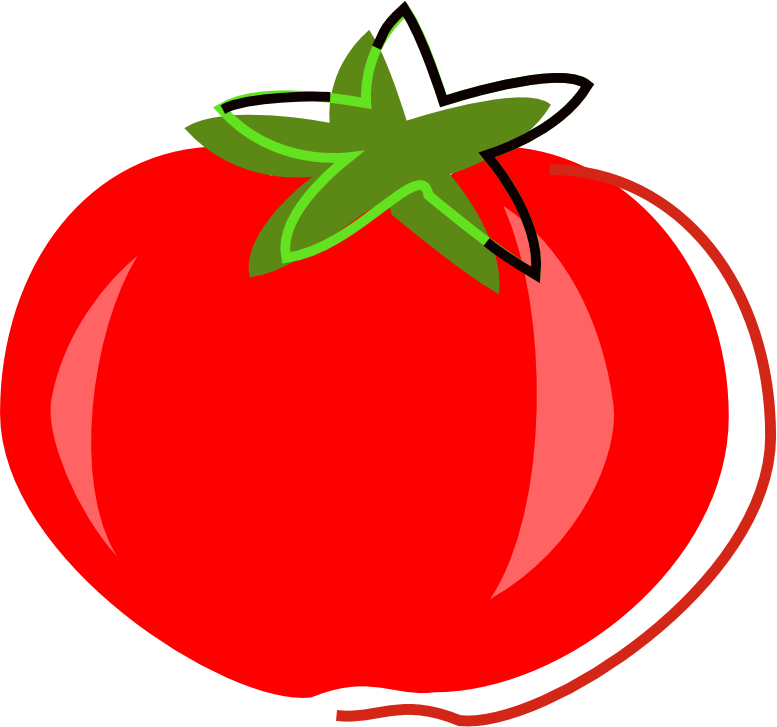
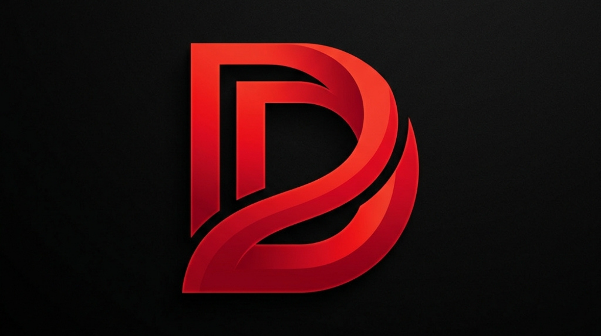
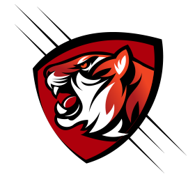
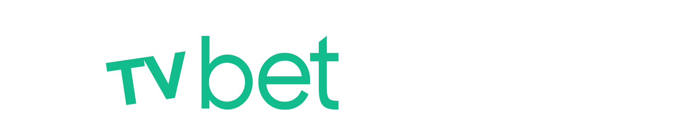
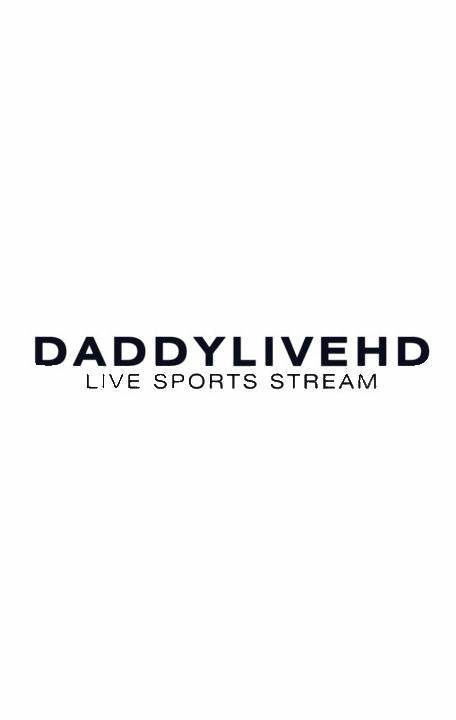
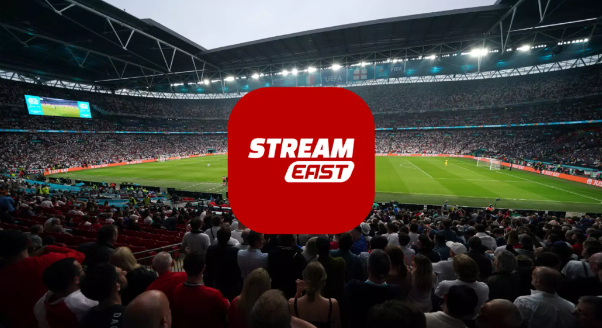
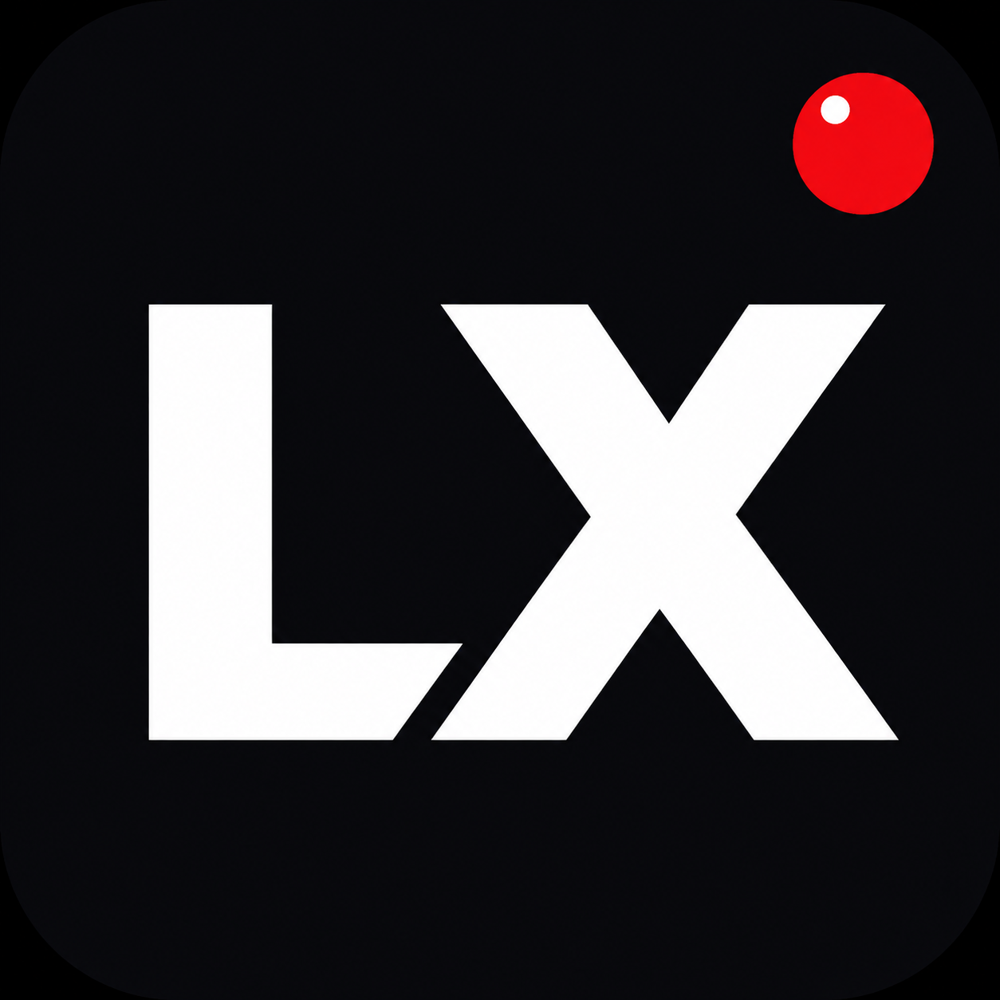

<p align="center">
  
</p>

<p align="center">
  <a href="https://intradeus.github.io/http-protocol-redirector?r=cloudstreamrepo://raw.githubusercontent.com/Wiojelt/TurkSpor/main/repo.json"></a><br>
  <strong>Logoya dokun: TurkSpor deposu CloudStream'e eklenir.</strong>
</p>

<p align="center">
  
  <a href="https://kotlinlang.org/"></a>
</p>

<p align="center">
  <strong>Önce destek eklentisi, ardından 27 spor sağlayıcısı ayrı ayrı.</strong><br>
  Her sağlayıcının ⚙ ekranında bağlantı kontrolü ve güncelleme durumu bulunur. Aslan TV kanalları kendi eklentisinde topludur.
</p>

<p align="center">
  <a href="https://buymeacoffee.com/wiojelt"></a><br>
  <a href="https://buymeacoffee.com/wiojelt">Bir kahveyle destek ol ☕</a>
</p>

<p align="center">
  <a href="https://github.com/Wiojelt"></a>
  <a href="https://t.me/wioj3lt"></a>
</p>

<details>
<summary>⚖ DMCA</summary>

TurkSpor provides Cloudstream extensions that retrieve links and playback information from third-party services. This repository does not host video broadcasts. Third-party content and trademarks belong to their respective owners. Users must comply with applicable laws and permissions. Copyright concerns about a broadcast should be directed to its host; concerns about material in this repository can be reported through [Issues](https://github.com/Wiojelt/TurkSpor/issues).

TurkSpor, üçüncü taraf servislerden bağlantı ve oynatma bilgisi alan Cloudstream eklentileri sunar. Bu depo video yayınlarını barındırmaz. İçerikler ve markalar ilgili hak sahiplerine aittir. Kullanıcılar geçerli yasalara ve gerekli izinlere uymalıdır. Yayına ilişkin telif bildirimleri yayın hizmetine; depodaki materyallerle ilgili bildirimler [Issues](https://github.com/Wiojelt/TurkSpor/issues) üzerinden iletilebilir.

</details>

## 📥 Kurulum

<p align="center">
  <a href="https://intradeus.github.io/http-protocol-redirector?r=cloudstreamrepo://raw.githubusercontent.com/Wiojelt/TurkSpor/main/repo.json">
    
  </a>
</p>

**Önerilen yöntem: güncel CloudStream Beta / pre-release sürümünde `!turkspor` yazın. İstediğiniz sağlayıcıyı ayrı kurabilirsiniz.**

Eski `cutt.ly` kısa bağlantıları Türkiye'den açılamayabildiği için ünlemsiz eski kod yerine Beta'daki yeni `py.md` yöntemi kullanılır.

Cloudstream → Ayarlar → Eklentiler → Depo ekle. Kısa kod açılmazsa tam adres:

```text
https://raw.githubusercontent.com/Wiojelt/TurkSpor/main/repo.json
```

Depo eklenmiyorsa [WARP](https://one.one.one.one/) açın. İzlerken gerekip gerekmediği kaynağa ve bağlantınıza bağlıdır. Bazı yayınlar maç saatinde açılır.

<table align="center">
  <tr>
    <td align="center"><br>SelçukSports</td>
    <td align="center"><br>Taraftarium24</td>
    <td align="center"><br>İnat TV</td>
    <td align="center"><br>Crex</td>
    <td align="center"><br>Aslan TV</td>
  </tr>
  <tr>
    <td align="center"><br>İnat Box</td>
    <td align="center"><br>BeyazElma</td>
    <td align="center"><br>MahsunSports</td>
    <td align="center"><br>ArdaSpor</td>
    <td align="center"><br>MaçKeyfi</td>
  </tr>
  <tr>
    <td align="center"><br>Zbahis TV</td>
    <td align="center"><br>InterSporTV</td>
    <td align="center"><br>KralSporHD</td>
    <td align="center"><br>Streamed</td>
    <td align="center"><br>VivoX Spor</td>
  </tr>
  <tr>
    <td align="center"><br>Domates TV</td>
    <td align="center"><br>Domino TV</td>
    <td align="center"><br>TRGoals</td>
    <td align="center"><br>Betmatik TV</td>
    <td align="center"><br>NETV Gold</td>
  </tr>
  <tr>
    <td align="center"><br>NTVStream</td>
    <td align="center"><br>DaddyLive</td>
    <td align="center"><br>StreamEast</td>
    <td align="center"><br>Hesgoal</td>
    <td align="center"><br>LiveXTV</td>
  </tr>
  <tr>
    <td align="center"><br>PapazSports</td>
    <td align="center"><br>JestYayın</td>
    <td colspan="3" align="center">Her sağlayıcının kendi ⚙ güncelleme kontrolü vardır.</td>
  </tr>
</table>

<p align="center">
  Kaynakları hazırlayan ve güncel tutan tüm sağlayıcılara teşekkürler ♥<br>
  <strong>Aslan TV yapımcısına ayrıca teşekkür ederiz.</strong><br>
  Kaynaklarını TurkSpor’da derlememize verdiği izin ve emeği için minnettarız.<br>
  Bu listelerin asıl kaynağı Aslan TV’dir.
</p>

<p align="center">
  <a href="NOTICE.md">Atıflar</a> · <a href="LICENSE">GPL-3.0</a>
</p>
